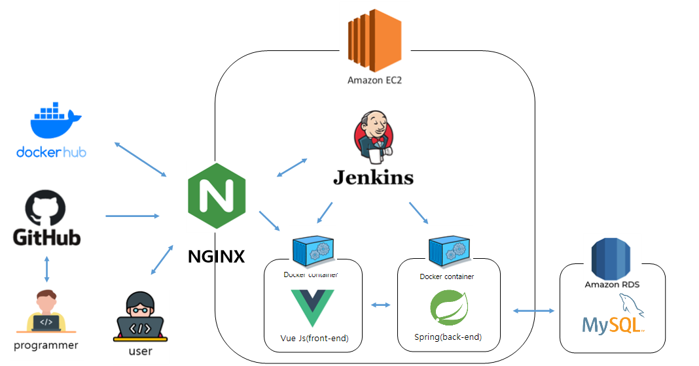
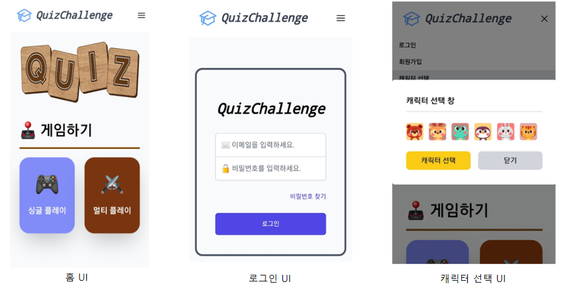
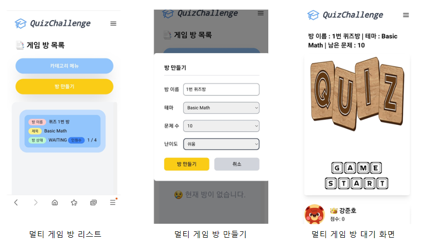
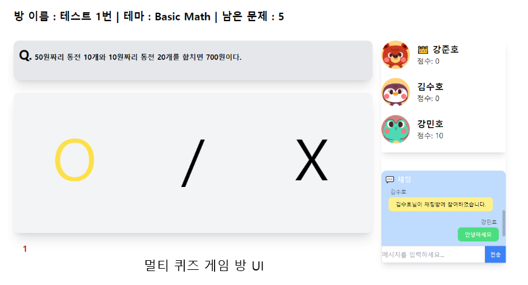

# 🕹 퀴즈 챌린지

> 퀴즈 게임을 통한 흥미로운 교육 서비스 제공  
> 각종 다양한 분야에 대한 퀴즈 게임 서비스 제공  

### [퀴즈 챌린지 백 엔드 링크](https://github.com/0320kangk/quiz_challenge_back.git)
 

## 📕 프로젝트 목적 및 내용

 

+ 프로젝트 목적
    + 흥미로운 학습 및 교육 서비스 제공
    + 실시간 퀴즈 문제 생성을 통한 다양한 문제 풀이 경험 제공
+ 프로젝트 내용
    + open ai를 통한 4지선다 및 OX 퀴즈 문제 제공
    + 싱글 퀴즈 게임 서비스 제공
    + 웹 소켓을 통한 멀티 퀴즈 게임 서비스 제공

## ⚙ 프로젝트 구조
 

## 📝 주요 업무 및 상세 역할
 

+ 주요 업무
    + 풀 스택 개발 (개인 프로젝트)
+ 작업 기간
    + 2024 06 ~ 2024 07 (1개월)
+ 상세 역할
    + 프론트 엔드 개발
    + 백 엔드 API 서비스 개발
    + JWT를 통한 로그인 서비스 구현
    + NGINX를 통한 HTTPS 서비스 구현
    + Open AI GPT-3.5 를 통한 퀴즈 문제 생성 로직 구현
    + Jenkins를 통한 CI/CD 구축
    + DB 설계 및 구현
    + Web Socket을 통한 게임 서비스 구현

## 🤝유지보수 툴

# ⚙️ 기술 스택

### Environment

### Front-End

### Back-End

### API

### 프로젝트 ERD
 

## 📱 프로젝트 UI (모바일)
 

  

  

## 💻 프로젝트 UI (PC)

